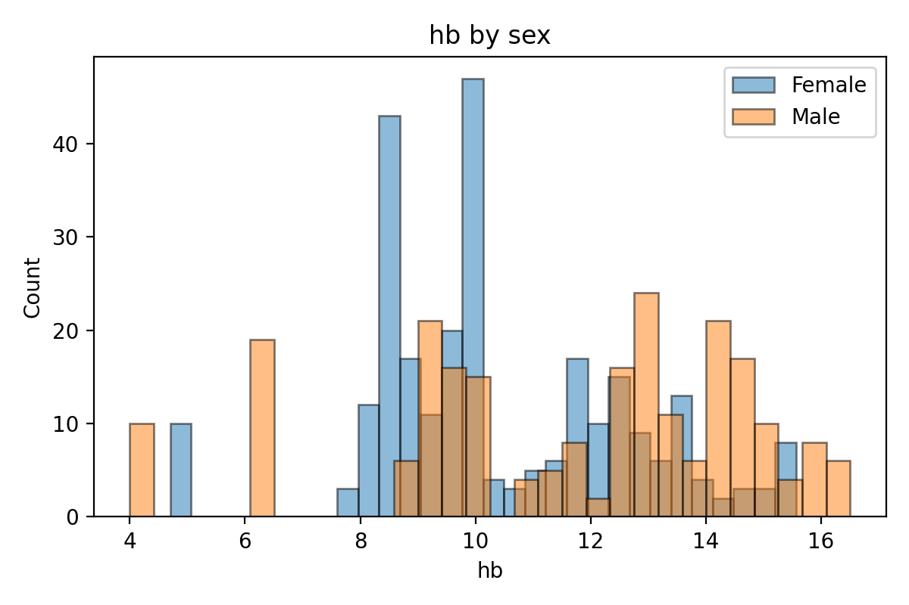
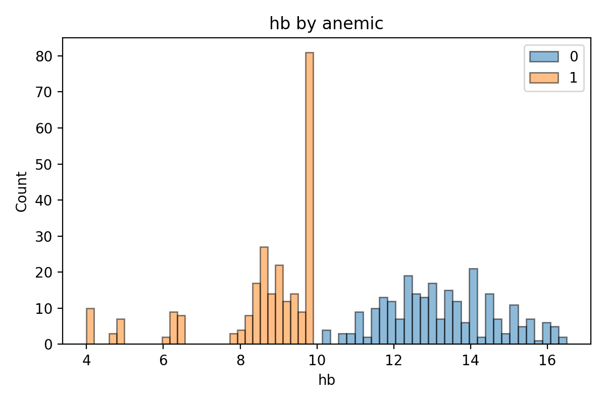
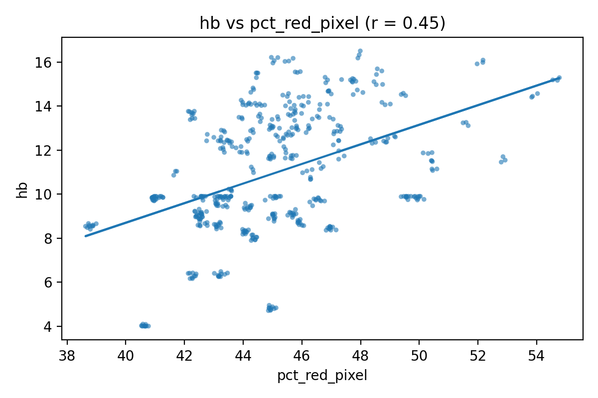
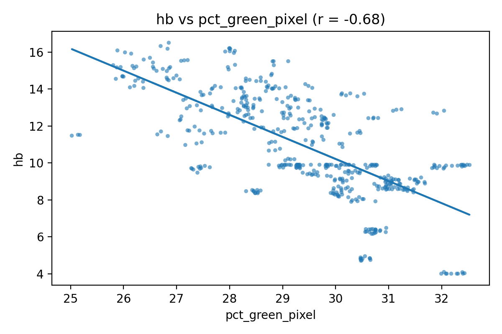
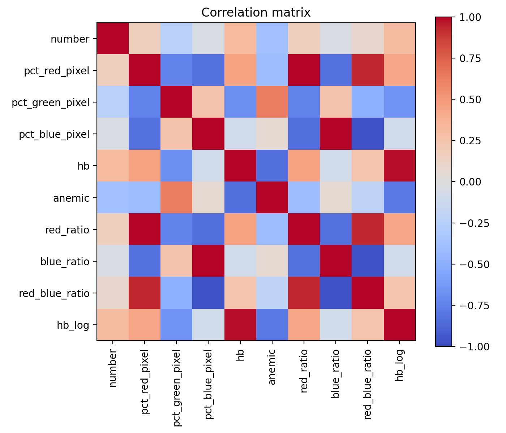

# Anemia Color Exploratory Data Analysis

Exploratory data analysis of image-derived red, green, and blue pixel counts and hemoglobin levels with patient sex and anaemic status. Began as final project for Intro to Python for Data Science class, but I decided to flesh it out for a larger-scale project.


## Data background:

The dataset was sourced from [Kaggle](https://www.kaggle.com/) and contains anonymized fingertip images paired with measured hemoglobin (Hb) levels and basic demographic information (sex and anemia status). Each image was pre-processed to extract proportion of the red, green, and blue pixel intensities.

These pixel percentages serve as simple quantitative descriptors of skin coloration, which is physiologically linked to blood oxygenation and hemoglobin concentration. Higher **red pixel intensity** generally corresponds to higher Hb levels and lower anemia likelihood, while higher **green pixel intensity** tends to indicate lower Hb and a greater likelihood of anemia. The **blue pixel intensity** shows little consistent relationship and primarily captures lighting variation rather than physiological differences. 

### Data Contract

| Column          | Type  | Allowed / Range | Units | Notes |
|-----------------|-------|-----------------|-------|-------|
| `Number`        | int   | ≥ 0             | —     | No duplicates |
| `Sex`           | str   | `Male`,`Female` | —     | Normalized case |
| `%Red Pixel`    | float | 0–100           | %     | Must be numeric (float) and within range |
| `%Green pixel`  | float | 0–100           | %     | Must be numeric (float) and within range |
| `%Blue pixel`   | float | 0–100           | %     | Must be numeric (float) and within range |
| `Hb`            | float | 1–25            | g/dL  | Implemented bounds for QC |
| `Anemic`       | int   | {0,1}           | —     | Normalized from labels |

## Repository Structure

```
data/
├──features.csv
├──processed.csv
└──data.csv
notebooks/
├──01_eda-ARCHIVE.ipynb
└──02_eda.ipynb
reports/
├──figures/
└──anemia_group_summary.csv
src/
├──features.py
├──ingest.py
└──validate.py
```

## Workflow

| Stage | Description |
|-------|--------------|
| **1. Ingest** | Cleans and standardizes the raw dataset (column names, types, ranges). |
| **2. Validate** | Ensures data contract integrity (types, missing values, value bounds). |
| **3. Feature Engineering** | Creates derived ratios and log-transformed Hb. |
| **4. EDA** | Visualizes color relationships, class separability, and statistical patterns. |

## Key Findings

- Hemoglobin (Hb) shows a bimodal, right-skewed distribution, with males averaging higher.
- `pct_red_pixel` is moderately positively correlated with Hb (r ≈ 0.45).
- `pct_green_pixel` is strongly negatively correlated with Hb (r ≈ -.68).
- `red_ratio` and `red_blue_ratio` also show moderate relationships with Hb.
- Cohen's d ≈ 3.1 -> large separation between anemic and non-anemic groups.

## Plots Featured

| Plot | Description |
|------|--------------|
|  | Hemoglobin levels are clearly separated by sex, with males showing higher average Hb and a right-shifted distribution. This supports known biological variation and explains the bimodal shape of the overall Hb distribution. |
|  | Anemic and non-anemic groups display a distinct separation in Hb levels, confirming the expected physiological threshold around 10 g/dL. |
|  | Hb levels show a moderate positive correlation with red pixel intensity (r ≈ 0.45), indicating that higher redness in images corresponds to higher hemoglobin concentration. |
|  | Hb levels exhibit a strong negative correlation with green pixel intensity (r ≈ −0.68), indicating that higher green intensity in images corresponds to lower hemoglobin concentration.  |
|  | Confirms Hb–color feature relationships and highlights the predictive potential of red and green intensity metrics. |

## Next Steps

- Extend the analysis to include predictive modeling (logistic regression).  
- Test feature importance and color ratios as early anemia indicators.  
- Explore larger or real-world clinical image datasets for validation.

## Tech Stack

Python (pandas, numpy, matplotlib)

## Author

**Kyle Uphus**  
The Ohio State University · Data Analytics B.S.  